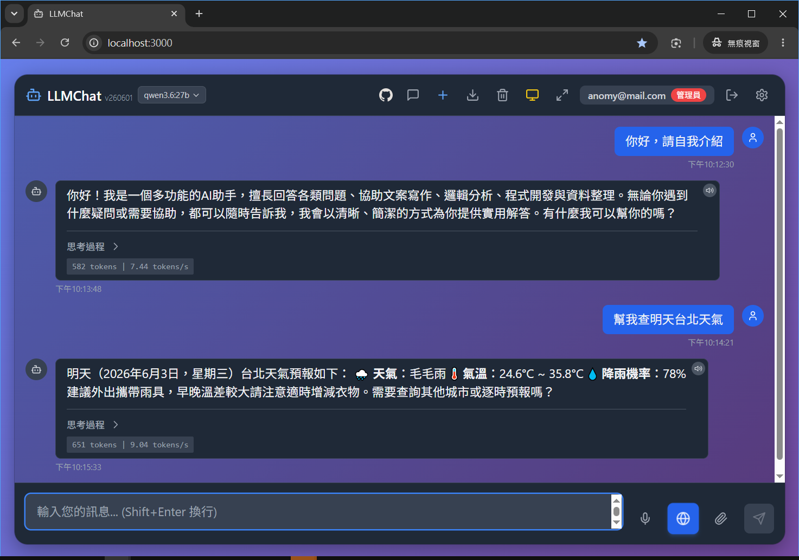

[English](#llmchat-english) | [繁體中文](#llmchat-繁體中文)

# LLMChat (English)

**LLMChat** is a modern, local Large Language Model (LLM) chat application featuring a sleek glassmorphism design. Built on React + Node.js + Ollama, it offers an aesthetically stunning, smooth, and full-featured conversational experience. 

It is highly recommended for **enterprises looking to deploy on-premise AI chat services** for internal departments, ensuring sensitive data and conversation privacy never leak to cloud providers.

<p align="center">
  
</p>

## 🌟 Key Features

- 🎨 **Modern Glassmorphism UI**: Stunning glassmorphism visuals with adaptive gradient backgrounds (Light/Dark themes), offering a premium and responsive mobile/desktop design.
- 💬 **Premium Chat Experience**: Real-time streaming (SSE) response and thinking process display, featuring auto-scroll, Markdown rendering, one-click code copy, fast model selection, and hotkeys.
- 🔍 **Live Web Search**: Enabled by default (web toggle), with 5-language intelligent intent classification (weather, news, forex, etc.) and a parallel stock quote parser.
- 🔊 **Smart Voice Interface**: Support for multi-lingual Voice Input (STT) and Text-to-Speech (TTS) with an intelligent audio player queue to prevent overlapping voices.
- ⚙️ **Multi-Provider Integration**: Out-of-the-box support for 20+ LLM providers (Ollama, OpenAI, Gemini, Claude, NIM, etc.) with dynamic vision model selection, maxTokens slider, and Base64 image upload.
- 🔐 **OAuth Connections**: Backend support for GitHub Copilot OAuth integration.
- 🔒 **Security & Admin Control**: Email registration verification (SMTP toggle), auto-activation of the first registered admin, and full admin dashboard for user CRUD, password reset, and role management.
- 📂 **Privacy & Storage**: Support for up to 50MB file uploads (TXT, Images, PDF), localized UI, and secure isolated user session backups.

## ⌨️ Hotkeys

- **Ctrl/Cmd + I**: New conversation
- **Ctrl/Cmd + K**: Clear current chat
- **Ctrl/Cmd + ,**: Toggle settings panel
- **Ctrl/Cmd + B**: Toggle conversation sidebar
- **Escape**: Close all open panels
- **Enter**: Send message (Shift + Enter for new line)

## 🏗️ Architecture

- **Frontend**: React 18, TypeScript, Vanilla CSS, Vite, Lucide React, React i18next
- **Backend**: Node.js + Express, Ollama SDK, Nodemailer, Axios

## 📋 System Requirements

- **Node.js** 18.0.0 or higher
- **NPM** 8.0.0 or higher
- **Ollama** - Local LLM environment

## 🚀 Quick Start

### 1. Install Dependencies
```bash
npm install
```

### 2. Start Application
```bash
npm start
```
The application will start, and your browser will automatically open [http://localhost:3000](http://localhost:3000).
> **Tip**: By default, this project uses local Ollama. Make sure Ollama is running and the model (e.g. `llama3`) is pulled.
> For code development, use: `npm run dev`

### 3. 🐳 Running with Docker
Express automatically serves the compiled frontend static files inside the container, requiring only a single port (default `8080`):
```bash
# 1. Build the image
docker build -t llmchat .

# 2. Start the container
docker run -d -p 8080:8080 --env-file .env -v ${PWD}/server/data:/app/server/data --name llmchat llmchat
```
Visit [http://localhost:8080](http://localhost:8080) to start chatting.

## 🔄 Git Update
To fetch updates and rebuild:
```bash
git pull
npm install
npm run build
npm start
```
> **⚠️ Note**: If changes do not reflect, press **`Ctrl + F5`** (Mac: **`Cmd + Shift + R`**) to force refresh browser cache.

## 🔧 Environment Configuration

Copy `.env.example` to `.env` and update configuration parameters:
- **LLM Settings**: `LLM_PROVIDER` (e.g., `ollama`, `openai`, `gemini`), `LLM_BASE_URL`, `LLM_API_KEY`, `LLM_MODEL`.
- **SMTP Settings**: Configure `SMTP_HOST`, `SMTP_PORT`, `SMTP_USER`, `SMTP_PASS` to enable registration.

- Refer to [.env.example](file:///.env.example) for detailed environment variable usage.

## 📝 Important Notes

1. **Privacy**: All user data and chat history are saved locally (`server/data/`), never uploaded to the cloud.
2. **First Admin Auto-Activation**: The first user to register becomes the administrator instantly and bypasses email verification.
3. **SMTP registration lock**: If SMTP settings are missing, registration is disabled (only Admin can create users).
4. **OAuth token storage**: The current OAuth session bindings are stored in backend memory and will be cleared after server restart unless later migrated to persistent storage.
5. **Hardware**: Running local LLM requires significant RAM (8GB+ recommended).
6. **Backup**: Backup the `server/data/` directory to restore user history on a new server.
7. **Streaming Reliability**: The backend monitors response termination events (`res.on('close')`) to safely cancel streaming generation, preventing resource leaks when users navigate away.

## 📂 Documents

- 🎯 [API Specification](api.md): Detailed backend REST/SSE endpoint specs.
- 🔄 [Changelog](CHANGELOG.md): History of version updates.

---

# LLMChat (繁體中文)

**LLMChat** 是一款融合現代化玻璃擬態（Glassmorphism）設計的本地大語言模型（LLM）聊天應用程式。基於 React + Node.js + Ollama 建構，旨在提供極致美觀、流暢且功能齊全的對話體驗。

本專案非常適合**企業快速建構全地端（On-Premise）的 AI 聊天服務**，可直接部署給內部各部門使用，確保敏感企業資料與對話私隱絕不外流至第三方雲端廠商。

<p align="center">
  
</p>

## 🌟 功能特色

- 🎨 **現代玻璃擬態 UI**：精美的玻璃擬態視覺設計，支援自適應漸層背景（亮色/暗色主題與跟隨系統），提供響應式行動端介面與全螢幕沉浸聊天。
- 💬 **卓越的對話體驗**：支援即時串流（SSE）回應與流式思考過程顯示；內建智慧滾動、Markdown 渲染、代碼一鍵複製、快速模型切換與鍵盤快捷鍵。
- 🔍 **即時聯網搜尋**：預設啟用網路搜尋功能（地球開關），具備 5 國語言智慧意圖過濾（天氣、新聞、匯率等），並配備智慧多路並行股價解析引擎。
- 🔊 **智慧語音互動**：支援多國語言的語音輸入（STT）與語音朗讀（TTS），並內建智慧語音播放隊列，確保多條語音按順序播放而不相互中斷。
- ⚙️ **多 Provider 整合**：全面支援 20+ 組主流雲端與本地 LLM 提供商（Ollama, OpenAI, Gemini, Claude, NIM 等），支援拉霸調整 Context Size、多模態 Vision 模型自動檢測與圖片 Base64 智慧傳輸。
- 🔐 **OAuth 帳號連接**：後端已支援 GitHub Copilot OAuth 帳號綁定授權。
- 🔒 **安全認證與管理**：提供電子郵件驗證的使用者註冊與登入（SMTP 動態開關），首位註冊者免驗證直升 Admin。管理員可直接在後台進行使用者 CRUD、密碼重設與角色管理。
- 📂 **資料隱私與存檔**：支援高達 50MB 檔案上傳（文字、圖片、PDF等），多語系介面（繁/簡/英/日/韓），以及使用者對話獨立分檔備份與還原。

## ⌨️ 快捷鍵支援

應用程式支援以下鍵盤快捷鍵，提升操作效率：
- **Ctrl/Cmd + I**: 創建新對話
- **Ctrl/Cmd + K**: 清除當前對話內容
- **Ctrl/Cmd + ,**: 開啟/關閉設定面板
- **Ctrl/Cmd + B**: 開啟/關閉對話列表面板
- **Escape**: 關閉所有開啟的面板
- **Enter**: 發送消息（Shift + Enter 換行）

## 🏗️ 技術架構

- **前端**：React 18, TypeScript, Vanilla CSS, Vite, Lucide React, React i18next
- **後端**：Node.js + Express, Ollama SDK, Nodemailer, Axios

## 📋 系統需求

- **Node.js** 18.0.0 或更高版本
- **NPM** 8.0.0 或更高版本
- **Ollama** - 本地大語言模型執行環境

## 🚀 快速開始

### 1. 安裝依賴
```bash
npm install
```

### 2. 啟動應用程式
```bash
npm start
```
應用程式啟動後，瀏覽器會自動開啟前端介面 [http://localhost:3000](http://localhost:3000)，即可開始使用。
> **提示**：本專案預設使用本地 Ollama。請確保您的系統已安裝並啟動 Ollama，且已下載所需的模型（例如執行 `ollama pull llama3`）。
> 如果您需要修改程式碼進行開發，請使用：`npm run dev`

### 3. 🐳 使用 Docker 執行
本專案已封裝 Docker 支援，Express 會自動在容器內部進行前端靜態檔案託管，對外只需暴露單一埠口（預設 `8080`）：

```bash
# 1. 構建映像檔
docker build -t llmchat .

# 2. 啟動容器 (掛載本地資料以防資料遺失，並帶入 env 設定)
docker run -d -p 8080:8080 --env-file .env -v ${PWD}/server/data:/app/server/data --name llmchat llmchat
```
啟動後，即可直接透過 [http://localhost:8080](http://localhost:8080) 訪問。

## 🔄 獲取更新 (Git Update)
當本專案在多台電腦上部署或更新時，請在各台電腦的終端機執行以下步驟，以拉取最新程式碼並重新編譯前端：
```bash
git pull
npm install
npm run build
npm start
```
> **⚠️ 重要提示**：在另一台電腦更新後，如果瀏覽器畫面的按鈕或功能沒有出現，請在瀏覽器中按下 **`Ctrl + F5`** (Mac 為 **`Cmd + Shift + R`**) 強制清除快取重新整理！

## 🔧 配置說明 (環境變數)

> **💡 生產環境部署建議**：若此專案需導入生產環境或供企業多部門正式使用，強烈建議建立並配置 `.env` 檔案，以確保雲端 API 金鑰、郵件服務（SMTP）以及單一埠口靜態託管等設定能正確且安全地套用。

複製 `.env.example` 為 `.env` 並修改相關設定：
- **LLM 提供商設定**：`LLM_PROVIDER` (如 `ollama`, `openai`, `gemini` 等)、`LLM_BASE_URL`、`LLM_API_KEY`、`LLM_MODEL` 等。
- **SMTP 郵件設定**（可選）：配置 `SMTP_HOST`、`SMTP_PORT`、`SMTP_USER`、`SMTP_PASS` 以啟用使用者註冊功能。若未配置，註冊功能將自動關閉。

- 詳細的環境變數說明與範例設定請直接參考 [.env.example](file:///.env.example) 檔案。

## 🌟 多 Provider 支援列表

系統內建支援以下 20 種不同的服務商與開源方案，全面涵蓋主流雲端與本地部署應用場景：
1. **主流雲端 API**: OpenAI, Anthropic Claude, Google Gemini, xAI (Grok)
2. **高CP值與開源社群 API**: Groq, Mistral, Moonshot AI (Kimi), Together AI, NVIDIA NIM
3. **API 網關與路由平台**: OpenRouter, Kilo Gateway, Vercel AI Gateway, Cloudflare AI Gateway, Synthetic
4. **本地與自託管方案**: Ollama, Ollama Cloud, vLLM, SGLang, LM Studio, Custom Provider

## 📝 注意事項

1. **私隱與安全性**：所有使用者資料與對話紀錄皆安全儲存於本地檔案系統（`server/data/`），預設絕不上傳雲端，確保完全的資料自主權。
2. **首位管理員機制**：系統啟動後，首位註冊的使用者將免除 Email 驗證並自動提權為 `admin` 管理員。
3. **郵件服務（SMTP）**：若未配置 SMTP 設定，系統將自動停用一般使用者註冊功能，此時僅允許管理員手動新增使用者。
4. **OAuth 憑證儲存方式**：目前 Google OAuth 與 ChatGPT session 綁定資料僅儲存在後端記憶體，伺服器重啟後會清空；若需正式上線，建議改為持久化儲存。
5. **地端硬體要求**：執行本地 LLM 對硬體要求較高，建議主機配備至少 8GB 以上記憶體（RAM），並預留足夠空間下載 AI 模型。
6. **備份與還原**：管理員可定期備份 `server/data/` 資料夾，如有需要只需將檔案複製回原路徑並重啟伺服器。
7. **智慧中斷與資源釋放**：後端精確監聽 HTTP 回應的 `close` 事件（`res.on('close')`），一旦使用者關閉視窗或連線中斷，即自動終止地端模型推理，徹底防止伺服器運算資源洩漏與空轉。

## 📂 相關文件

- 🎯 [API 介面文件](api.md)：了解後端提供的詳細 HTTP/SSE 端點定義。
- 🔄 [版本更新日誌](CHANGELOG.md)：詳細的歷史版本變更與升級日誌。

## 🤝 貢獻與授權

歡迎提交 Issue 和 Pull Request！本專案基於 **MIT License** 授權，詳見 [LICENSE](LICENSE) 檔案。

---
**享受與本地 AI 模型的美觀對話體驗吧！** ✨
