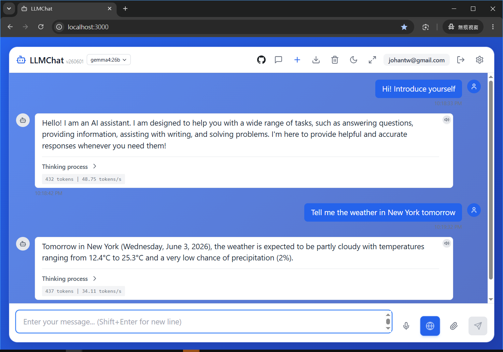

> 🇹🇼 繁體中文: [readme.md](readme.md)

# LLMChat (English)

**LLMChat** is a modern, local Large Language Model (LLM) chat application featuring a sleek glassmorphism design. Built on React + Node.js + Ollama, it offers an aesthetically stunning, smooth, and full-featured conversational experience. 

It is highly recommended for **enterprises looking to deploy on-premise AI chat services** for internal departments, ensuring sensitive data and conversation privacy never leak to cloud providers.

<p align="center">
  
</p>

## 🌟 Key Features

- 🎨 **Modern Glassmorphism UI**: Stunning glassmorphism visuals with adaptive gradient backgrounds (Light/Dark themes), offering a premium and responsive mobile/desktop design.
- 💬 **Premium Chat Experience**: Real-time streaming (SSE) response and thinking process display, featuring auto-scroll, Markdown rendering, one-click code copy, fast model selection, and hotkeys.
- 🔍 **Live Web Search**: Enabled by default (web toggle), with 5-language intelligent intent classification (weather, news, forex, etc.) and a parallel stock quote parser.
- 🔊 **Smart Voice Interface**: Support for multi-lingual Voice Input (STT) and Text-to-Speech (TTS) with an intelligent audio player queue to prevent overlapping voices.
- ⚙️ **Multi-Provider Integration**: Out-of-the-box support for 20+ LLM providers (Ollama, OpenAI, Gemini, Claude, NIM, etc.) with dynamic vision model selection, maxTokens slider, and Base64 image upload.
- 🔐 **OAuth Connections**: Backend support for GitHub Copilot OAuth integration.
- 🔒 **Security & Admin Control**: Email registration verification (SMTP toggle), auto-activation of the first registered admin, and full admin dashboard for user CRUD, password reset, and role management.
- 📂 **Privacy & Storage**: Support for up to 50MB file uploads (TXT, Images, PDF), localized UI, and secure isolated user session backups.

## ⌨️ Hotkeys

- **Ctrl/Cmd + I**: New conversation
- **Ctrl/Cmd + K**: Clear current chat
- **Ctrl/Cmd + ,**: Toggle settings panel
- **Ctrl/Cmd + B**: Toggle conversation sidebar
- **Escape**: Close all open panels
- **Enter**: Send message (Shift + Enter for new line)

## 🏗️ Architecture

- **Frontend**: React 18, TypeScript, Vanilla CSS, Vite, Lucide React, React i18next
- **Backend**: Node.js + Express, Ollama SDK, Nodemailer, Axios

## 📋 System Requirements

- **Node.js** 18.0.0 or higher
- **NPM** 8.0.0 or higher
- **Ollama** - Local LLM environment

## 🚀 Quick Start

### 1. Install Dependencies
```bash
npm install
```

### 2. Start Application
```bash
npm start
```
The application will start, and your browser will automatically open [http://localhost:3000](http://localhost:3000).
> **Tip**: By default, this project uses local Ollama. Make sure Ollama is running and the model (e.g. `llama3`) is pulled.
> For code development, use: `npm run dev`

### 3. 🐳 Running with Docker
Express automatically serves the compiled frontend static files inside the container, requiring only a single port (default `8080`):
```bash
# 1. Build the image
docker build -t llmchat .

# 2. Start the container
docker run -d -p 8080:8080 --env-file .env -v ${PWD}/server/data:/app/server/data --name llmchat llmchat
```
Visit [http://localhost:8080](http://localhost:8080) to start chatting.

## 🔄 Git Update
To fetch updates and rebuild:
```bash
git pull
npm install
npm run build
npm start
```
> **⚠️ Note**: If changes do not reflect, press **`Ctrl + F5`** (Mac: **`Cmd + Shift + R`**) to force refresh browser cache.

## 🔧 Environment Configuration

Copy `.env.example` to `.env` and update configuration parameters:
- **LLM Settings**: `LLM_PROVIDER` (e.g., `ollama`, `openai`, `gemini`), `LLM_BASE_URL`, `LLM_API_KEY`, `LLM_MODEL`.
- **SMTP Settings**: Configure `SMTP_HOST`, `SMTP_PORT`, `SMTP_USER`, `SMTP_PASS` to enable registration.

- Refer to [.env.example](file:///.env.example) for detailed environment variable usage.

## 📝 Important Notes

1. **Privacy**: All user data and chat history are saved locally (`server/data/`), never uploaded to the cloud.
2. **First Admin Auto-Activation**: The first user to register becomes the administrator instantly and bypasses email verification.
3. **SMTP registration lock**: If SMTP settings are missing, registration is disabled (only Admin can create users).
4. **OAuth token storage**: The current OAuth session bindings are stored in backend memory and will be cleared after server restart unless later migrated to persistent storage.
5. **Hardware**: Running local LLM requires significant RAM (8GB+ recommended).
6. **Backup**: Backup the `server/data/` directory to restore user history on a new server.
7. **Streaming Reliability**: The backend monitors response termination events (`res.on('close')`) to safely cancel streaming generation, preventing resource leaks when users navigate away.

## 📂 Documents

- 🎯 [API Specification](api.md): Detailed backend REST/SSE endpoint specs.
- 🔄 [Changelog](CHANGELOG.md): History of version updates.

---

